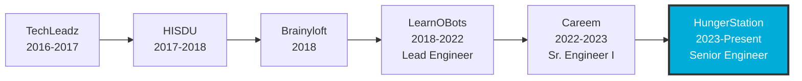

<div align="center">

# 👋 Hi, I'm Arslan Arshad

### Senior Software Engineer | Backend Specialist | Microservices Architect

<p>
  <a href="https://linkedin.com/in/iamarslan"></a>
  <a href="https://github.com/arslan77/resume"></a>
  <a href="mailto:arslanarshad07@gmail.com"></a>
  <a href="https://arslan77.github.io"></a>
</p>


</div>

---

## 🚀 About Me

```go
type Engineer struct {
    Name        string
    Role        string
    Location    string
    Company     string
    Experience  int
    Focus       []string
}

me := Engineer{
    Name:       "M Arslan Arshad",
    Role:       "Senior Software Engineer (Backend)",
    Location:   "Dubai, UAE 🇦🇪",
    Company:    "HungerStation (Delivery Hero)",
    Experience: 8,
    Focus: []string{
        "Microservices Architecture",
        "Distributed Systems",
        "API Development",
        "Cloud Infrastructure",
        "Team Leadership",
    },
}
```

🔭 **Currently**: Leading Integration Squad at HungerStation, building scalable microservices for vendor integrations across 50+ partners

🌱 **Learning**: Advanced system design patterns, Kubernetes at scale, AI/ML integration in production systems

💡 **AI-Powered**: Leveraging Claude AI, GitHub Copilot, and Cursor for enhanced productivity

📄 **Resume**: Multi-template LaTeX resume with automated CI/CD → [arslan77/resume](https://github.com/arslan77/resume)

---

## 🛠️ Tech Stack

### Languages


### Frameworks & Tools


### Databases


### DevOps & Cloud


### AI Tools


---

## 💼 Professional Journey



**Current Role @ HungerStation (Delivery Hero)**
- 🎯 Lead Integration Squad - Microservices for 50+ vendor partners
- ⚡ Optimized GoLang services - 35% API response time improvement
- 👥 Mentoring junior engineers - Code reviews & technical workshops
- 📊 Implemented Prometheus/Grafana monitoring

---

## 📊 GitHub Stats

<div align="center">


</div>

---

## 🏆 Highlight Projects

### 📄 [Multi-Template Resume System](https://github.com/arslan77/resume)
Automated LaTeX resume generation with multiple templates, GitHub Actions CI/CD, and version management
- 🎨 Multiple templates (Awesome-CV, Deedy)
- 🤖 Automated PDF builds on push
- 📦 Release management with versioned downloads
- ⚙️ Docker-based compilation

### 🔐 GunneboBGR - Airport Security System
Facial recognition and security management system for airport operations
- 🎥 Real-time facial recognition
- 📊 Security analytics dashboard
- 🔄 Integration with airport systems

### 📧 PingPong Lead Generation
B2B marketing automation platform with email campaigns
- 📈 Automated lead scoring
- 📧 Multi-channel campaigns
- 📊 Analytics and reporting

### 🏭 POULTA IoT Platform
IoT platform processing data from 500+ poultry farm devices
- 📡 AWS IoT Core/Greengrass integration
- 🤖 Predictive analytics for farm optimization
- 📈 Real-time monitoring dashboard

---

## 🎓 Education

**MS in Information Technology** - NUST SEECS, Islamabad (2017-2020)
- CGPA: 3.19/4.0
- Specialization: Software Engineering & Distributed Systems

**BS in Computer Science** - NFC IET, Multan (2013-2017)
- CGPA: 3.67/4.0
- Graduated with Distinction

---

## 📈 Activity Graph

[](https://github.com/arslan77)

---

## 🤝 Let's Connect!

<div align="center">

💼 Open to interesting backend engineering opportunities and collaborations!

📧 **Email**: arslanarshad07@gmail.com
💼 **LinkedIn**: [linkedin.com/in/iamarslan](https://linkedin.com/in/iamarslan)
🌐 **Portfolio**: [arslan77.github.io](https://arslan77.github.io)
📄 **Resume**: [github.com/arslan77/resume](https://github.com/arslan77/resume)

---


**⭐ From [arslan77](https://github.com/arslan77) - Building scalable systems, one microservice at a time!**

</div>
